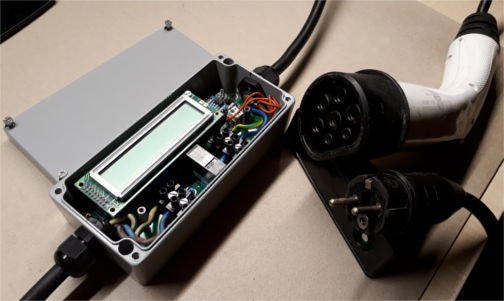

# Electrovehicle IEC 62196 Typ 2 charger met-16

## Features:

* Charger Box for electro vehicle 230V/16A -> IEC 62196 Typ 2
* Charge current adjustable between 7A and 16A
* Controlled by Atmel Atmega328P microcontroller (Arduino nano)
* Optional: voltage and current measurement on board
* Optional: LCD connector (2x20 characters, 4 bit mode)

## Newest version ready to use

* [Branch v0.3](https://github.com/greenenergyprojects/electro-vehicle-charger-met16/tree/v0.3)
* PCB: [kicad/dist](kicad/dist)
* Software: [software/atmega328p_u1/ev-charge-control/released](software/atmega328p_u1/ev-charge-control/released)

See README.md files in subfolders for more information.

